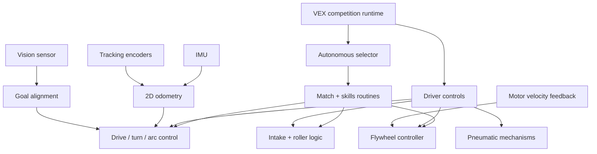

# 2496R Ratcheting Raccoons — Competition Robot Software

Historical software from VEX Robotics team 2496R's 2022–2023 *Spin Up* robot. The system coordinated a four-motor drivetrain, flywheel, intake, vision sensor, odometry hardware, pneumatic mechanisms, autonomous routines, and driver controls on the VEX V5 platform.

Joshua Tian led the eight-member team through iterative mechanical and software integration, testing, and competition strategy. The team finished the season as a **State Champion** and reached **#1 in Global Driver Skills**.

> This is a team codebase, preserved as an engineering artifact rather than presented as a solo software project. The original commit history identifies individual code contributors.

## Control architecture

## Technical highlights

- **Closed-loop motion:** PID-based drive, turn, point-to-point, and arc-turn primitives with settle tolerances, timeouts, acceleration limiting, and heading correction.
- **Localization:** two-dimensional odometry using tracking-wheel deltas and IMU heading, updated in a background PROS task.
- **Shooter control:** asynchronous flywheel velocity regulation with feedforward, error tracking, and moving-average filtering.
- **Autonomous strategy:** multiple near-side, far-side, match, and skills routines coordinating drive motion, disc indexing, rollers, and pneumatic actions.
- **Vision and sensors:** calibrated red/blue goal signatures, optical sensing for roller control, tracking encoders, IMU feedback, and controller telemetry.
- **Reusable utilities:** coordinate and pose types, PID controllers, cubic Bézier evaluation, lookup-table path utilities, timers, filters, and angle math.

## Code guide

The `v2` tree is the most complete competition implementation. The `v3` tree captures a later experimental refactor into reusable hardware and control abstractions.

| Area | Start here | What it demonstrates |
| --- | --- | --- |
| Runtime integration | [`v2/src/main.cpp`](v2/src/main.cpp) | Competition callbacks, vision calibration, autonomous dispatch, and concurrent odometry/flywheel tasks |
| Autonomous routines | [`v2/src/autons.hpp`](v2/src/autons.hpp) | Full match and skills sequences built from subsystem commands |
| Chassis control | [`v2/src/chassis.hpp`](v2/src/chassis.hpp) | PID drive/turn control, heading correction, arc motion, and coordinate targeting |
| Localization | [`v2/src/odom.hpp`](v2/src/odom.hpp) | Encoder/IMU pose updates and coordinate transforms |
| Flywheel | [`v2/src/flywheel.hpp`](v2/src/flywheel.hpp) | Velocity feedback, feedforward, filtering, and asynchronous control |
| Intake and rollers | [`v2/src/intake.hpp`](v2/src/intake.hpp) | Disc indexing, optical-sensor roller logic, and subsystem coordination |
| Math and controls | [`v2/src/util.hpp`](v2/src/util.hpp) | PID, moving averages, Bézier curves, timers, poses, and geometry helpers |
| Hardware map | [`v2/src/global.hpp`](v2/src/global.hpp) | Motors, encoders, IMU, vision, optical sensors, pneumatics, and controller configuration |
| Library refactor | [`v3/src/lib/robot`](v3/src/lib/robot) | Reusable motor, sensor, pneumatic, operator-control, and sequencing abstractions |

## Software evolution

- **`v1/` — VEXcode prototype:** early chassis, odometry, and path-following experiments.
- **`v2/` — competition system:** the season's integrated PROS application, including the full mechanism stack and autonomous library.
- **`v3/` — architectural refactor:** a later effort to separate robot-specific behavior from reusable control and hardware abstractions.

## Repository scope

This repository intentionally preserves the source as it existed during the season. The `v2` and `v3` folders contain source snapshots rather than complete standalone PROS projects, so building them requires creating a compatible PROS V5 project and restoring the matching SDK/build files. The code is best reviewed as a record of the team's control-system architecture, autonomous development, and season-long iteration.

## Technology

`C++` · `PROS` · `VEX V5` · `PID control` · `odometry` · `autonomous robotics` · `computer vision` · `sensor fusion` · `pneumatics` · `real-time tasks`
